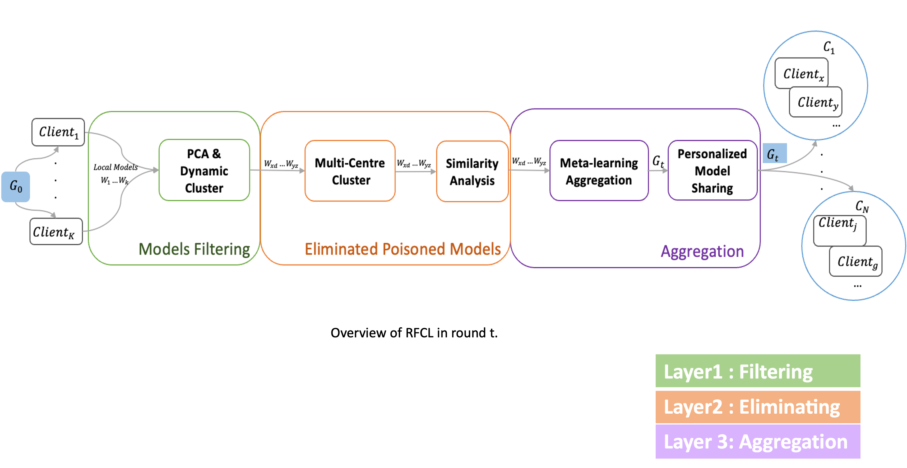

<h1>Robust Federated Learning Method against Data and Model Poisoning Attacks with Heterogeneous Data Distribution</h1>

<h2>Overview</h2>
    
RFCL is an implementation of a novel federated learning approach that combines multi-centre meta-learning, 
      internal robust aggregation, cosine similarity-based cluster selection, and personalized model sharing to enhance the robustness 
      and performance of federated learning systems. This repository contains the source code and resources to reproduce the results presented 
      in the paper "Robust Federated Learning Method against Data and Model Poisoning Attacks with Heterogeneous Data Distribution". The paper has been accepted to the ECAI2023. 

   
    <h2>Features</h2>
    <ul>
        <li>Multi-center meta-learning for generating representative cluster centres </li>
        <li>Internal robust aggregation for fair and effective model aggregation</li>
        <li>Cosine similarity-based cluster selection for improved external aggregation</li>
        <li>Personalized model sharing to align models with specific data distributions</li>
        <li>Robustness against poisoning attacks with non-IID data</li>
    </ul>
    <h2>Robust Aggregation in FL</h2>
    
We Have six main aggregation schemes, including FedAvg (not robust), MKrum, Median, AFA, FedMGDA+, and CC. These aggregation methods are 
    carefully evaluated to assess their robustness against different adversarial attacks and data distribution scenarios.

    <h2>FL Adversarial Strategies</h2>
    
We explore different adversarial attack strategies, such as Inner Product Manipulation (IPM), A Little Is Enough (ALIE), sign-flipping, random noise injection, and label-flipping. The evaluation considers various numbers of attackers and Non-IID data distributions on multiple datasets, including MNIST, CIFAR-10, and Fashion-MNIST.

    <h2>Work Built Upon References</h2>
    <ul>
    <li>It is built upon the work of Samuel Trew's Federated Learning repository, available at <a href="https://github.com/SamuelTrew/FederatedLearning">https://github.com/SamuelTrew/FederatedLearning</a>.</li>
   <li>Luis Muñoz-González, Kenneth T Co, and Emil C Lupu. 2019. Byzantine-robust federated machine learning through adaptive model averaging. arXiv preprint arXiv:1909.05125 (2019). </li>
<li>Peva Blanchard, Rachid Guerraoui, Julien Stainer, et al. 2017. Machine learning with adversaries: Byzantine tolerant gradient descent. In Advances in Neural Information Processing Systems. 119–129.</li>
<li>Dong Yin, Yudong Chen, Ramchandran Kannan, and Peter Bartlett. 2018. Byzantine-Robust Distributed Learning: Towards Optimal Statistical Rates. In International Conference on Machine Learning. 5650–5659.</li>
<li>Zeou Hu, Kiarash Shaloudegi, Guojun Zhang, and Yaoliang Yu, ‘Fed- erated learning meets multi-objective optimization’, IEEE Transactions on Network Science and Engineering, (2022). </li>
<li>Sai Praneeth Karimireddy, Lie He, and Martin Jaggi, ‘Learning from history for byzantine robust optimization’, in International Conference on Machine Learning, pp. 5311–5319. PMLR, (2021). </li>
<li>Cong Xie, Oluwasanmi Koyejo, and Indranil Gupta, ‘Fall of empires: Breaking byzantine-tolerant sgd by inner product manipulation’, in Un- certainty in Artificial Intelligence, pp. 261–270. PMLR, (2020). </li>
<li>Gilad Baruch, Moran Baruch, and Yoav Goldberg, ‘A little is enough: Circumventing defenses for distributed learning’, Advances in Neural Information Processing Systems, 32, (2019). </li>

</ul>

